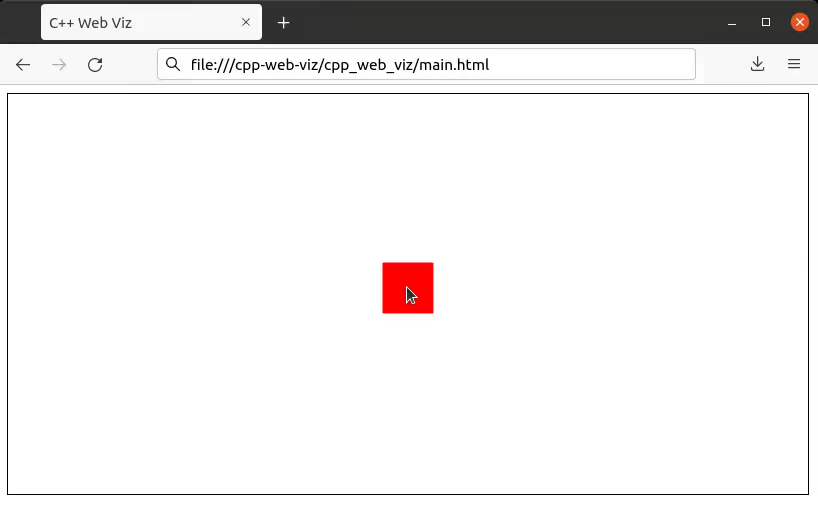

# C++ Web Viz

## Setup

### Install

* Clone the git repository.

  ```bash
  $ git clone https://github.com/shanekelly/cpp-web-viz.git --recursive
  ```

### Build

* Build the C++ code.

  ```bash
  $ cmake -B build
  $ cmake --build build
  ```

### Run

* Run the C++ server. This command simply runs one of the example servers.

  ```bash
  $ ./build/examples/box_follow_mouse_position/main
  ```

  You can change the executable path in the command above to point to one of the other examples
  shown [below](#examples) to try out some other examples.

  If you wrote your own server using C++ Web Viz, then replace this example executable with the path
  to your own server's executable.

* Run the browser-based client.

  ```bash
  $ firefox cpp_web_viz/main.html
  ```

  The same HTML file is always run from the browser regardless of what you are visualizing, which means
  more time writing C++ instead of JavaScript!

  Other browsers (besides Firefox) should also work here. If you prefer, the `cpp_web_viz/main.html`
  file can be drag-and-dropped into your web browser instead of being opened from the terminal.


## Examples

### Box Follow Mouse Position

A red square follows the mouse cursor around the screen and has its position clipped to the edges of
the screen.

[Link to code.](examples/box_follow_mouse_position)


