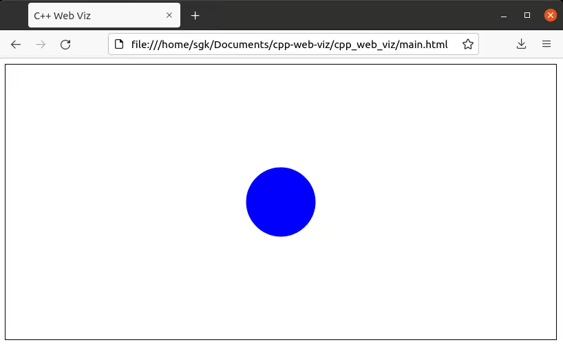

# C++ Web Viz

C++ Web Viz is a library that allows for making web visualizations using C++.

## Table of Contents

* [Setup](#setup)
  * [Install](#install)
  * [Build](#build)
  * [Run](#run)
* [Integrating Into Other Projects](#integrating-into-other-projects)
  * [Integration Instructions](#integration-instructions)
  * [Examples](#examples)
    * [Box Follow Mouse Position](#box-follow-mouse-position)
    * [Disk Arrow Key Movement](#disk-arrow-key-movement)

## Setup

### Install

* Clone the git repository.

  ```bash
  $ git clone https://github.com/shanekelly/cpp-web-viz.git --recursive
  ```

### Build

* Build the C++ code.

  ```bash
  $ cmake -B build
  $ cmake --build build
  ```

### Run

* Run the C++ server. This command simply runs one of the example servers.

  ```bash
  $ ./build/examples/box_follow_mouse_position/main
  ```

  You can change the executable path in the command above to point to one of the other examples
  shown [below](#examples) to try out some other examples.

  If you wrote your own server using C++ Web Viz, then replace this example executable with the path
  to your own server's executable.

* Run the browser-based client.

  ```bash
  $ firefox cpp_web_viz/main.html
  ```

  The same HTML file is always run from the browser regardless of what you are visualizing, which means
  more time writing C++ instead of JavaScript!

  Other browsers (besides Firefox) should also work here. If you prefer, the `cpp_web_viz/main.html`
  file can be drag-and-dropped into your web browser instead of being opened from the terminal.


## Integrating Into Other Projects

## Integration Instructions

Using C++ Web Viz in other projects is simple. Here is a minimal fully-functioning example:

  ```cpp
  #include <cpp_web_viz/rendering/rendering_server.hpp>

  class MyRenderingServer : public cpp_web_viz::RenderingServer {
    // Runs once at startup.
    void SetUp() override {
    }

    // Runs every frame.
    void Update() override {
    }
  };

  int main() {
    MyRenderingServer rendering_server;
    rendering_server.Run(720, 480, 60);  // width, height, update frequency

    return 0;
  }
  ```

### Examples

#### Box Follow Mouse Position

A red square follows the mouse cursor around the screen and has its position clipped to the edges of
the screen.

[Link to code.](examples/box_follow_mouse_position)


#### Disk Arrow Key Movement

A blue disk moves across the screen according to which arrow keys are pressed and has its position
clipped to the edges of the screen.

[Link to code.](examples/disk_arrow_key_movement)


